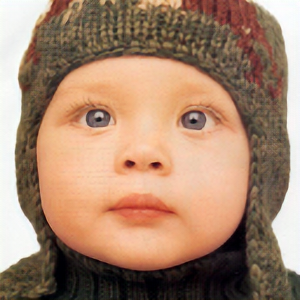
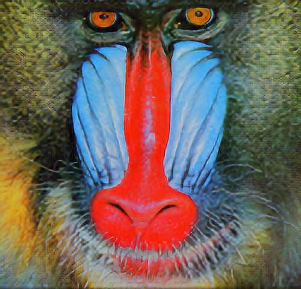
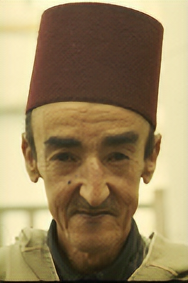
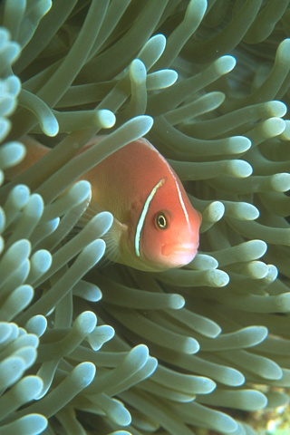
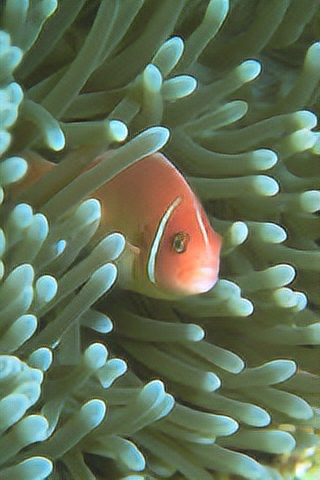
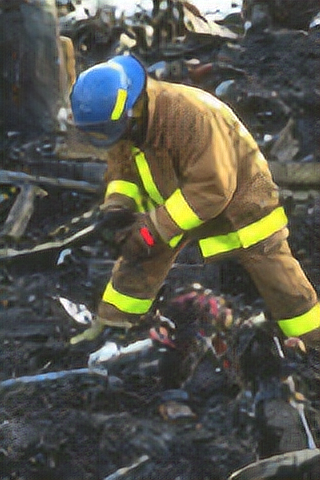

# SRGAN
Super Resolution GAN.

This is a re-implementation using Pytorch of SRGAN models based on original paper [Photo-Realistic Single Image Super-Resolution Using a Generative Adversarial Network](https://arxiv.org/abs/1609.04802).

# Requirements
* Pytorch
* tqdm
* easydict
* wandb

# Datasets

## Train Dataset

The train datasets is [ImageNet Large Scale Visual Recognition Challenge 2012 (ILSVRC2012)](https://image-net.org/index.php). The paper randomly chose 350 000 samples from ImageNet dataset for training process.

## Test Dataset

In this code, I use Set5 dataset for val and Set5, Set14, and BSD100 for evaluation. You can download dataset [here](https://drive.google.com/drive/folders/1A6lzGeQrFMxPqJehK9s37ce-tPDj20mD) as refered to this [github](https://github.com/Lornatang/SRGAN-PyTorch).

# Usage
## Train
Setting for training and evaluating: `config/config.yaml`. Download training dataset and modify `train:dataset:data_dir: <path/to/train/dataset>`

```
python src/main.py
```

## Evaluate

```
python src/eval.py
```

# Result
SRGAN was evaluated on these dataset: `BSD100, Set14, Set5`. With **scale x4**: from left to right: low resolution, resolved resolution (SRGAN), high resolution
## Set5
* psnr: 30.7253, ssim: 0.9823
<p float="left">
    
    
    
</p>

## Set14
* psnr: 20.3099, ssim: 0.9457
<p float="left">
    
    
    
</p>

* psnr: 20.9446, ssim: 0.9769
<p float="left">
    
    
    
</p>

## BDS100
* psnr: 31.7421, ssim: 0.9930
<p float="left">
    
    
    
</p>

* psnr: 29.6615, ssim: 0.9960
<p float="left">
    
    
    
</p>

* psnr: 23.4305, ssim: 0.9802
<p float="left">
    
    
    
</p>
